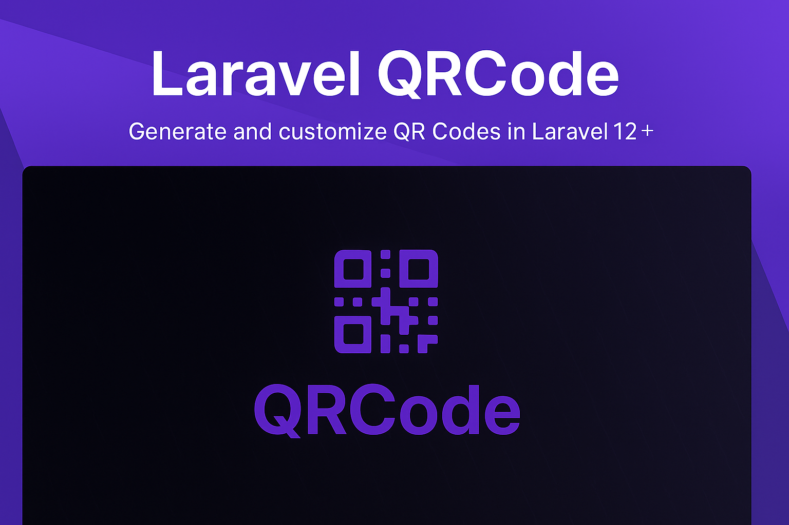

<div align="center">



[](https://packagist.org/packages/akira/laravel-qrcode)
[](https://github.com/akira/laravel-qrcode/actions/workflows/tests.yml)
[](https://github.com/akira/laravel-qrcode/actions/workflows/phpstan.yml)
[](https://packagist.org/packages/akira/laravel-qrcode)
</div>
A clean, modern, and easy-to-use QR code generator for Laravel applications. Built with the Action Pattern, Value Objects, and full type safety.


## Features

- Multiple output formats (PNG, SVG, EPS)
- Highly customizable (colors, gradients, styles, sizes)
- Specialized data types (WiFi, Email, vCard, Calendar, Phone, SMS, Geo, Bitcoin, Ethereum, Litecoin)
- Logo/image merging support
- Type-safe with PHP 8.4+
- PHPStan Level 9 compliant
- Comprehensive test coverage

## Requirements

- PHP 8.4+
- GD extension
- Imagick extension for PNG output
- Laravel 12.0+

## Installation

Install via Composer:

```bash
composer require akira/laravel-qrcode
```

Optionally, publish the configuration:

```bash
php artisan vendor:publish --tag="qrcode-config"
```

## Quick Start

```php
use Akira\QrCode\Facades\QrCode;

// Simple text
$qrCode = QrCode::text('Hello World');

// With customization
$qrCode = QrCode::size(300)
    ->color(255, 0, 0)
    ->text('https://example.com');

// WiFi network
$qrCode = QrCode::wifi([
    'ssid' => 'MyNetwork',
    'password' => 'secret123'
]);

// Email
$qrCode = QrCode::email('contact@example.com', 'Subject', 'Body');

// Contact card
$qrCode = QrCode::vcard([
    'fullName' => 'Jane Doe',
    'email' => 'jane@example.com'
]);

// Calendar event
$qrCode = QrCode::ical([
    'summary' => 'Release planning',
    'startsAt' => '2026-06-01 10:00:00 UTC',
    'endsAt' => '2026-06-01 11:00:00 UTC'
]);

// Phone
$qrCode = QrCode::phone('+1234567890');

// Ethereum
$qrCode = QrCode::ethereum(
    '0x0000000000000000000000000000000000000001',
    '1000000000000000000'
);

// Litecoin
$qrCode = QrCode::litecoin('ltcaddress', 1.25);

// With styling
$qrCode = QrCode::size(400)
    ->gradient(255, 0, 0, 0, 0, 255, 'diagonal')
    ->style('round', 0.7)
    ->eye('circle')
    ->text('Styled QR Code');
```

## Documentation

Complete documentation is available in the package website: [https://packages.akira-io.com/packages/laravel-qrcode](https://packages.akira-io.com/packages/laravel-qrcode)


## Available Data Types

| Type | Description | Example |
|------|-------------|---------|
| WiFi | Network credentials | `QrCode::wifi(['ssid' => 'Network', 'password' => 'pass'])` |
| Email | mailto links | `QrCode::email('email@example.com', 'Subject', 'Body')` |
| vCard | Contact cards | `QrCode::vcard(['fullName' => 'Jane Doe'])` |
| Calendar | VEVENT calendar entries | `QrCode::ical(['summary' => 'Meeting', 'startsAt' => '2026-06-01 10:00:00 UTC', 'endsAt' => '2026-06-01 11:00:00 UTC'])` |
| Phone | Direct dial | `QrCode::phone('+1234567890')` |
| SMS | Pre-filled message | `QrCode::sms('+1234567890', 'Hello')` |
| Geo | GPS coordinates | `QrCode::geo(37.7749, -122.4194, 'San Francisco')` |
| Bitcoin | Payment address | `QrCode::bitcoin('address', 0.001, ['label' => 'Donation'])` |
| Ethereum | Payment address | `QrCode::ethereum('0x...', '1000000000000000000', ['chainId' => 1])` |
| Litecoin | Payment address | `QrCode::litecoin('address', 1.25, ['label' => 'Donation'])` |

## Customization Options

| Option | Description | Values |
|--------|-------------|--------|
| Size | Dimensions in pixels | `size(300)` |
| Colors | Foreground/background | `color(r, g, b)`, `backgroundColor(r, g, b)` |
| Gradients | Color transitions | `gradient(r1, g1, b1, r2, g2, b2, 'type')` |
| Styles | Module shapes | `style('square\|dot\|round', 0-1)` |
| Eyes | Pattern styles | `eye('square\|circle')`, `eyeColor(...)` |
| Error Correction | Data recovery | `errorCorrection('L\|M\|Q\|H')` |
| Formats | Output type | `format('png\|svg\|eps')` |
| Logo | Image merging | `merge('/path/to/logo.png', 0.2)` |

## Usage Examples

### In Blade Templates

```blade
{!! QrCode::format('png')->generate('https://example.com') !!}
```

### API Response

```php
return response()->json([
    'qrcode' => base64_encode(QrCode::format('png')->generateRaw($data))
]);
```

### Download Response

```php
$png = QrCode::format('png')->size(500)->generateRaw($data);

return response($png)
    ->header('Content-Type', 'image/png')
    ->header('Content-Disposition', 'attachment; filename="qrcode.png"');
```

### With Logo

```php
$qrCode = QrCode::format('png')
    ->size(400)
    ->errorCorrection('H')
    ->merge(public_path('logo.png'), 0.2)
    ->text('https://example.com');
```

## Testing

```bash
# Run code quality checks and tests
composer test

# Run code style fixer
composer lint
```

## Architecture

This package is built with:

- **Action Pattern** - Single-responsibility business logic
- **Value Objects** - Immutable, validated data structures
- **Dependency Injection** - Laravel IoC container
- **Type Safety** - PHP 8.4+ with readonly classes
- **SOLID Principles** - Clean, maintainable code

See [Architecture Documentation](docs/09-architecture.md) for details.

## Contributing

Contributions are welcome! Please see [Contributing Guide](CONTRIBUTING.md) for details.

## Security

If you discover any security issues, please email kidiatoliny@gmail.com instead of using the issue tracker.

## Credits

- [Kidiatoliny](https://github.com/kidiatoliny)
- Built with [BaconQrCode](https://github.com/Bacon/BaconQrCode)
- All Contributors

## License

The MIT License (MIT). Please see [License File](LICENSE) for more information.

## Links

- [Website](https://packages.akira-io.com/packages/laravel-qrcode)
- [Changelog](CHANGELOG.md)
- [Issue Tracker](https://github.com/akira-io/laravel-qrcode/issues)
- [Packagist](https://packagist.org/packages/akira/laravel-qrcode)
